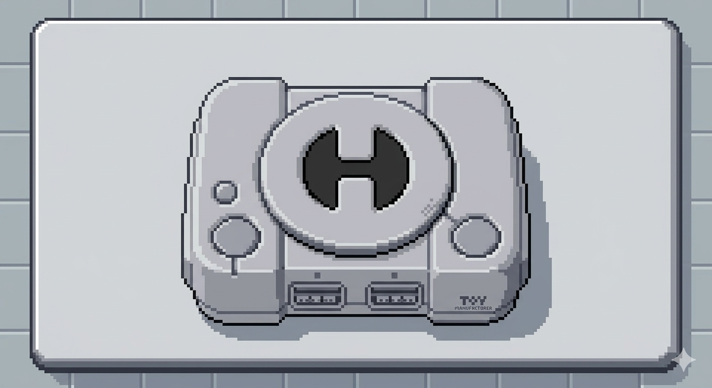
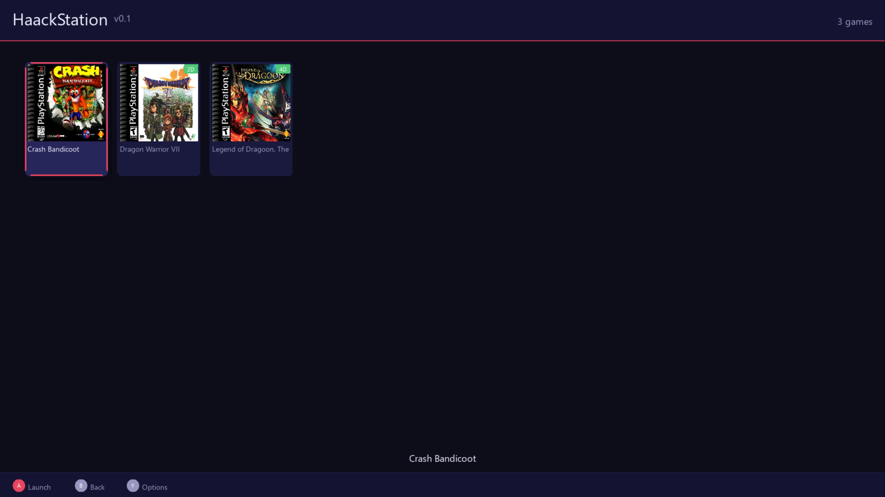
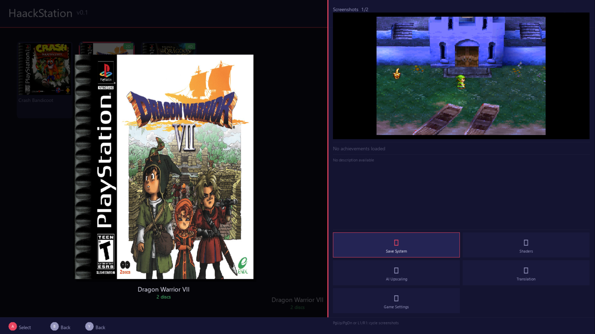

# HaackStation

<div align="center">



**The premier PlayStation 1 frontend — user-friendly, feature-rich, free forever.**

[](https://www.gnu.org/licenses/old-licenses/gpl-2.0.en.html)
[](https://github.com/cloudhaacker/HaackStation)
[](https://github.com/libretro/beetle-psx-libretro)
[-purple)](https://anthropic.com)

*Built on Beetle PSX HW / Mednafen via the libretro interface*

</div>

---

## What Is HaackStation?

HaackStation is an open source PlayStation 1 emulator frontend built on top of Beetle PSX HW. It wraps a proven, cycle-accurate emulation core in a modern, controller-first interface with features that existing PS1 frontends simply don't have.

**Controller-first** — the entire UI is navigable with a gamepad. No mouse required. Every screen shows context-sensitive button hints at the bottom so you're never guessing what a button does.

**Free forever** — GPLv2. No paywalls, no paid tiers, no exceptions. Every feature listed here is free.

**Openly AI-assisted** — HaackStation is developed with Claude (Anthropic AI) writing code under the direction of the project author. This is disclosed openly because honesty about tooling matters. See [AI Assistance](#ai-assistance) below.

---

## Screenshots

| Game Shelf | Game Details Panel |
|:---:|:---:|
|  |  |

| RetroAchievements | Details — Dragon Warrior VII |
|:---:|:---:|
|  |  |

---

## Feature Status

| Feature | Status |
|---------|--------|
| Game shelf with spring-scroll animations | ✅ Done |
| Cover art display (scraped from ScreenScraper.fr) | ✅ Done |
| Multi-disc game support (M3U auto-generation) | ✅ Done |
| Controller navigation (Xbox/PS controllers) | ✅ Done |
| Keyboard navigation (conflict-free layout) | ✅ Done |
| Settings screen (6 tabs, all wired) | ✅ Done |
| Game Details Panel (Y button) with screenshots | ✅ Done |
| ScreenScraper.fr scraper (cover, back cover, screenshots) | ✅ Done |
| Save states with thumbnail screenshots | ✅ Done |
| In-game menu (Start+Y) | ✅ Done |
| RetroAchievements infrastructure (rcheevos 12.3) | ✅ Done |
| Fast Boot (skip PS1 BIOS logo) | ✅ Done |
| Fast Forward (hold R2 / F key, 2×–8×) | ✅ Done |
| Play history (recently played tracking) | ✅ Done |
| Mouse cursor auto-hide in fullscreen | ✅ Done |
| RA achievement unlock submissions | ⏳ Pending RA approval (~July 2026) |
| CHD file hashing for RA | ⏳ Needs MAME CHD library |
| Shelf-flip L1/R1 (Recently Played / Favorites) | 🔨 In Progress |
| Audio queue hitch fix | 🔨 In Progress |
| Rewind (hold L2) | 📋 Planned |
| Favorites system | 📋 Planned |
| Text input dialog (on-screen keyboard) | 📋 Planned |
| Input remapping UI | 📋 Planned |
| Trophy Room (PS4/PS5 style) | 📋 Planned |
| Memory Card Manager with PS1 animated save icons | 📋 Planned |
| Spinning CD case animation | 📋 Planned |
| Color themes | 📋 Planned |
| Ambient music player | 📋 Planned |
| Dynamic shelf sizing | 📋 Planned |
| Android / Ayn Thor APK | 📋 Phase 5 |
| OpenGL hardware renderer (unlocks upscaling, PGXP) | 📋 Phase 5 |
| Netplay | 📋 Phase 5 |
| On-the-fly Japanese translation | 📋 Phase 5 |

---

## Building from Source

### Requirements

- Windows 10/11 (primary development platform)
- Visual Studio 2022 or 2026 Build Tools (MSVC)
- CMake 3.20+
- Git

### Dependencies (place in `deps/`)

Download from official SDL releases:

```
deps/
  SDL2/          — SDL2 VC development libraries
  SDL2_ttf/      — SDL2_ttf VC development libraries
  SDL2_image/    — SDL2_image VC development libraries
  rcheevos/      — rcheevos source (clone from github.com/RetroAchievements/rcheevos)
```

**SDL2 header fix (required):** The SDL2 VC zip puts headers directly in `include/`. Create `include/SDL2/` subfolders and copy the headers in — the code uses `#include <SDL2/SDL.h>` style includes.

### Build

```bash
# Fresh build
mkdir build && cd build
cmake .. -G "Visual Studio 17 2022" -A x64
cmake --build . --config Release

# Incremental build
cmake --build build --config Release
```

Output: `build/frontend/Release/HaackStation.exe`

### Runtime Layout

Place these files next to `HaackStation.exe`:

```
HaackStation.exe
core/
  mednafen_psx_hw_libretro.dll    ← Beetle PSX HW core
bios/
  scph1001.bin                    ← PS1 BIOS (US, recommended)
  scph5500.bin                    ← PS1 BIOS (JP, optional)
  scph5501.bin                    ← PS1 BIOS (US v2, optional)
  scph5502.bin                    ← PS1 BIOS (EU, optional)
assets/
  fonts/zrnic.otf
  icons/HaackStation_Logo.png
```

> **BIOS files are not included** and are never distributed with this project. You must supply your own, legally dumped from PS1 hardware you own.

---

## Configuration

Config file location: `%APPDATA%\HaackStation\haackstation.cfg`

```ini
[General]
roms_path=C:\Emulation\roms\psx
bios_path=
fullscreen=false
vsync=true
show_fps=false

[Emulation]
fast_boot=false
fast_forward_speed=1    ; 0=2x  1=4x  2=6x  3=8x

[Video]
renderer=0
internal_res=1
shader=0

[Audio]
audio_volume=100

[Scraper]
ss_user=your_screenscraper_username
ss_password=your_screenscraper_password

[RetroAchievements]
ra_user=your_ra_username
ra_api_key=              ; auto-populated after first login
ra_password=             ; used for initial login only, cleared after token saved
ra_hardcore=false
```

---

## Keyboard Controls

HaackStation works fully without a controller. The keyboard layout is carefully designed with no conflicts — WASD is reserved exclusively for in-game PS1 buttons.

### On the Game Shelf
| Key | Action |
|-----|--------|
| Arrow Keys | Navigate |
| X | Launch game |
| Enter | Open Settings |
| F2 | Open Game Details |
| Escape | Quit HaackStation |
| F11 | Toggle Fullscreen |

### In-Game
| Key | PS1 Button |
|-----|-----------|
| Arrow Keys | D-pad |
| X | Cross (×) |
| Z | Circle (○) |
| A | Square (□) |
| S | Triangle (△) |
| Q | L1 |
| W | R1 |
| E | L2 |
| R | R2 |
| Enter | Start |
| Space | Select |
| F (hold 500ms) | Fast Forward |
| F1 | In-game Menu |
| Escape | Quit to Shelf |

### In Game Details Panel
| Key | Action |
|-----|--------|
| Arrow Keys | Navigate menu |
| Page Up / Page Down | Cycle screenshots |
| X | Select menu item |
| Z | Close panel |

---

## Cover Art & Screenshots

HaackStation scrapes metadata and media from [ScreenScraper.fr](https://www.screenscraper.fr) — a free community database. Register a free account to get higher rate limits.

**To scrape:** Open Settings → General → Scrape Game Art. Enter your ScreenScraper credentials in the Scraper section first.

Media is saved to:
```
media/
  covers/[title].png          ← Front cover art
  covers/[title]_back.jpg     ← Back cover art
  screenshots/[title]/        ← Per-game screenshot folder
    01_screenshot.jpg
    02_titlescreen.jpg
    03_fanart.jpg
```

**Manual screenshots:** Drop any `.jpg` or `.png` files into `media/screenshots/[game title]/` and they'll appear in the Details Panel immediately.

---

## RetroAchievements

HaackStation has full rcheevos 12.3 integration using the rc_client API. Login, ROM hashing, achievement tracking, and notifications all work.

**Current limitation:** Achievement unlock submissions are blocked server-side pending official emulator recognition from RetroAchievements. We've applied and are waiting on the 6-month public availability requirement (~July 2026). The infrastructure is complete — unlocks will work automatically once we're approved.

Enter your RA credentials in Settings → RetroAchievements. After the first login, your session token is saved automatically and the password field can be cleared.

---

## Multi-Disc Games

HaackStation automatically handles multi-disc PS1 games:

1. Name your disc files with the pattern: `Game Name (Disc 1).chd`, `Game Name (Disc 2).chd`, etc.
2. HaackStation auto-generates an M3U playlist on first scan
3. The game appears as a single entry on the shelf with a disc count badge

Supported naming patterns: `(Disc N)`, `(Disk N)`, `(CD N)`, `Disc N`, `CD N`

---

## Supported Formats

| Format | Support |
|--------|---------|
| BIN/CUE | ✅ Full support |
| CHD | ✅ Full support |
| ISO | ✅ Full support |
| M3U | ✅ Full support (multi-disc playlists) |
| PBP | ❌ Not supported |

---

## Project Structure

```
HaackStation/
├── frontend/
│   ├── include/          ← Header files
│   │   ├── ui/           ← Game browser, settings, controller nav
│   │   ├── library/      ← Game scanner, disc formats
│   │   ├── renderer/     ← Theme engine
│   │   └── core_bridge/  ← libretro bridge headers
│   └── src/              ← Implementation files (mirrors include/)
├── deps/                 ← Third-party libraries (not committed)
├── assets/               ← Fonts, icons, logos
└── docs/                 ← Documentation and dev diary
```

---

## AI Assistance

HaackStation is openly AI-assisted. Here is the full accounting:

- **Vision, design, testing:** John Haack (project author)
- **Frontend code:** Claude (Anthropic AI), directed by the author
- **Emulation core:** Beetle PSX HW by the libretro team (not modified)
- **Logo/artwork:** Generated with Google Gemini AI, directed and refined by the author
- **Font (Zrnic):** Apostrophic Labs — [dafont.com/zrnic.font](https://www.dafont.com/zrnic.font)

Every design decision, feature request, and architectural choice came from the project author. The AI writes code under direction. This is disclosed openly because transparency about tooling is the right thing to do.

The full development story — including every build battle, design decision, and honest assessment of difficulty — is documented in the [Development Diary](docs/HaackStation_DevDiary_Complete.docx).

---

## Credits

### Emulation Core
**Beetle PSX HW / Mednafen** — the libretro team and all Mednafen contributors.
Every accurate frame HaackStation renders is their achievement.

### Libraries
- SDL2, SDL2_ttf, SDL2_image — zlib licence
- rcheevos 12.3 — RetroAchievements, MIT licence

### Community
To the emulation community, to RetroAchievements for building something worth achieving in, and to everyone who has kept PlayStation 1 gaming alive for 30 years.

---

## Legal

HaackStation is licensed under the **GNU General Public License v2.0**, inherited from Beetle PSX HW.

PlayStation is a registered trademark of Sony Interactive Entertainment LLC. HaackStation is not affiliated with Sony Interactive Entertainment.

BIOS files and game ROMs are never distributed with this project. Users supply their own from hardware they own.
